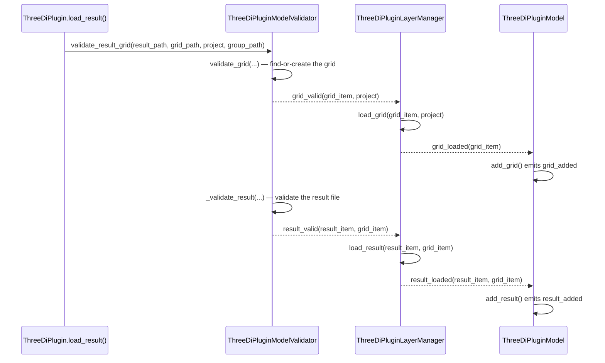
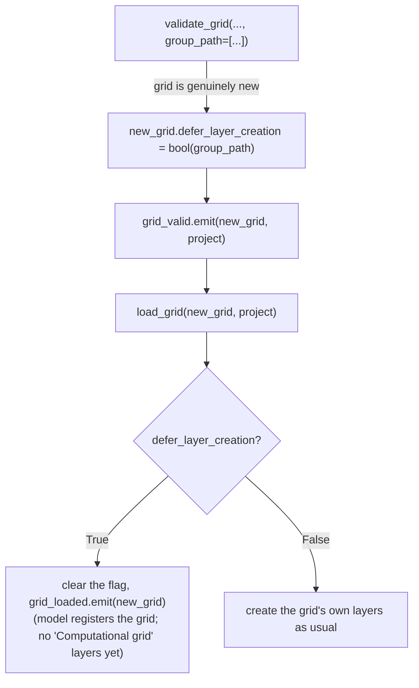
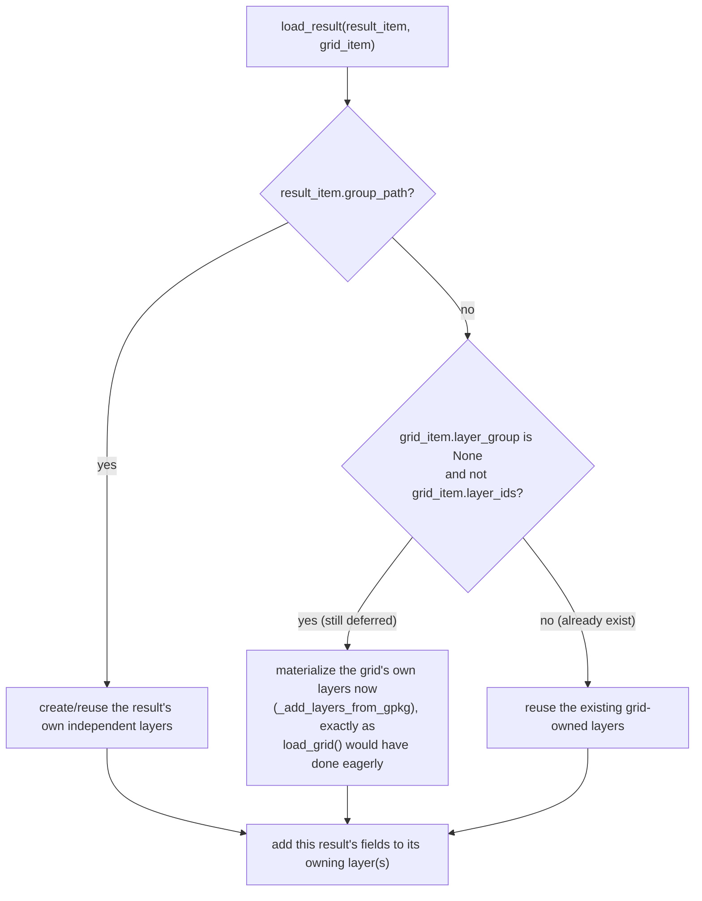
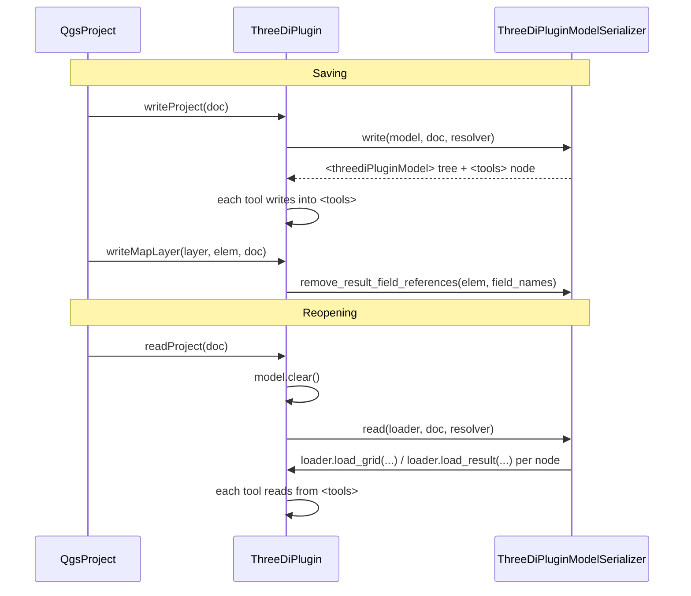
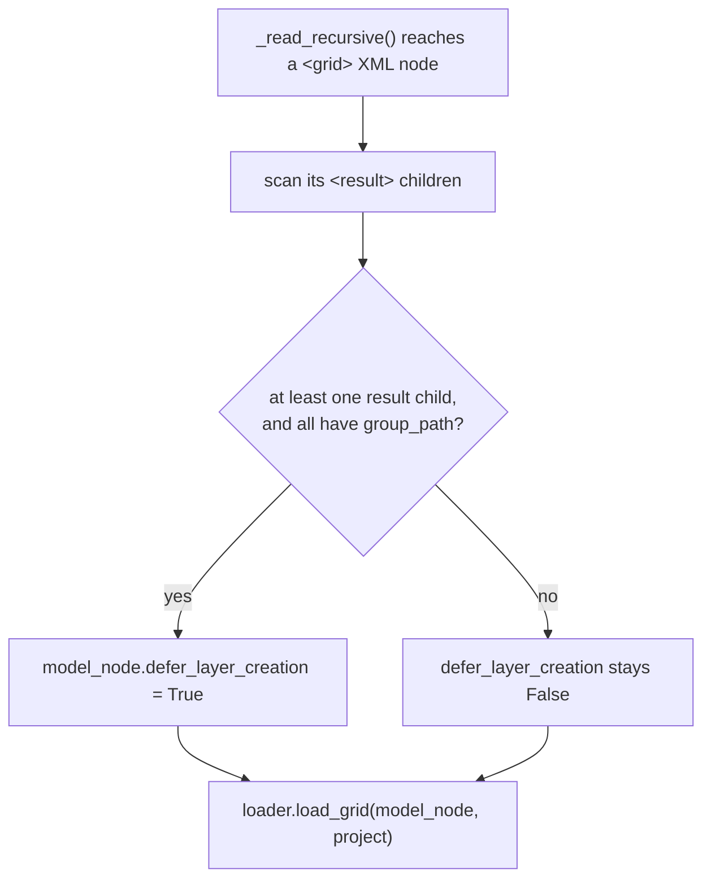

# Result loading and grouping

This describes how computational grids and simulation results get loaded into QGIS, and how the resulting layers are organized in the layer tree depending on the loading mode. It's a walk-through of one specific, cross-cutting flow: `ThreeDiPlugin.load_result()` (and the equivalent result-manager UI action) down to the QGIS layers that end up in the project.

Read this together with `threedi_plugin.py`, `threedi_plugin_model_validation.py` and `threedi_plugin_layer_manager.py`.

## Overview

Loading a result always goes through the same three collaborators, in the same order:



`ThreeDiPluginModel` is the source of truth for *what* is loaded (one `ThreeDiGridItem` per computational grid, with `ThreeDiResultItem` children). `ThreeDiPluginLayerManager` is the source of truth for *which QGIS layers* represent that state, and owns their lifecycle.

Two optional keyword arguments change how the QGIS layer tree is organized, without changing the model tree: `project` (for grouping results per project) and `group_path` (for grouping results per result file).

> [!IMPORTANT]
> `project` and `group_path' only affect the grouping in the layer panel, not in the results analysis dock widget. This gives three loading modes.

## Mode 1: standalone (no `project`, no `group_path`)

This is the mode used by the Results Analysis result-manager UI itself.

`load_grid()` converts the `.h5` gridadmin to a `.gpkg` (if needed) and copies its tables into memory layers directly under the layer-tree root, in a group named after the grid (`ThreeDiGridItem.text()`). Every result attached to that grid (`ThreeDiPluginLayerManager.load_result`) adds its own dynamic `result_...`/`initial_value_...` fields to *those same* grid-owned layers (`ThreeDiGridItem.layer_ids`). All results sharing a grid therefore share one set of QGIS layers; only the fields differ per result. `ThreeDiResultItem.group_path` is `None` in this mode. `Waterdepth` and the tool groups are likewise shared: they attach to the grid's own `layer_group`, not to an individual result, so multiple results on the same grid share them too (see `load_waterdepth()`, `tool_statistics/threedi_custom_stats_dialog.py`, `tool_watershed/watershed_analysis_dockwidget.py`).

Concretely, if Result A and Result B are both loaded against the same
computational grid, **both show up under this exact same `<grid name>`
group** — QGIS never gets a second, separate group for Result B. Then if a Result C was added for another grid, a new group is added:

```text
gridadmin foo/
├── Computational grid/          # shared by all results for the same model
├── Waterdepth/                  # shared group; one raster layer per result that has one
    ├── max wd result-a
    └── max wd result-b
└── Statistics/                  # shared group; one subgroup per result that used the tool
    └── result-a/
        └── ...
gridadmin bar/
├── Computational grid/
├── Waterdepth/layer per result that has one
    └── max wd result-c
└── Statistics/ per result that used the tool
    └── result-c/
        └── ...
```


## Mode 2: project-based (`project` keyword)

The layer tree gains one extra wrapper level compared to mode 1; layer ownership (including `Waterdepth` and the tool groups) is otherwise identical.

So if for the previous example the results for gridadmin foo and bar are in different projects, the tree looks like

```text
project foo/
   └── gridadmin foo/
       ├── Computational grid/
       └──  Waterdepth/
           ├── max wd result-a
           └── max wd result-b
project bar/
   └── gridadmin bar/
       ├── Computational grid/
       └──  Waterdepth/
           └── max wd result-c
```

But if Result A and Result B are in different projects, the three looks like:
```text
project foo/
   └── gridadmin foo/
       ├── Computational grid/
       └──  Waterdepth/
           └── max wd result-a
project bar/
   └── gridadmin foo/
       ├── Computational grid/
       └──  Waterdepth/
           └── max wd result-c  b
```


## Mode 3: grouped by source file (`group_path` keyword)

Used by the current Rana integration, which knows the ordered file-tree
location a result came from (e.g. `["<project>", "files", "folder", "result.zip"]`) and wants the QGIS layer tree to mirror it.

> [!NOTE]
> a non-empty `group_path` always takes precedence over `project`, even if both are supplied.

Unlike modes 1 and 2, a grouped result does **not** reuse the grid's shared layers. `ThreeDiPluginLayerManager.load_result()` copies fresh, independent vector-layer instances from the same underlying GeoPackage into the  result's *own* layer group (`ThreeDiResultItem.layer_group` `ThreeDiResultItem.layer_ids`). This lets two results that share one computational grid (same schematisation revision, different result files) have independent visibility, styling, aliases, fields and cleanup. The underlying `.gpkg` conversion is still only performed once and reused. The `ThreeDiGridItem` itself is *not* duplicated: the Results Analysis model still keeps one logical grid item per computational grid, and multiple grouped results (with different `group_path` values) can be children of the same grid item. Only the *QGIS layers* differ per result; the *model* tree looks the same as in the other modes.

In grouped mode, each ThreeDiResultItem stores its group_path, its result-owned layer_group, and its result-owned layer_ids. The result remains a child of the matching ThreeDiGridItem in the Results Analysis model, but its QGIS layers are tracked independently from the grid. In non-grouped modes these result-owned attributes remain unused: the result uses its parent grid’s layer_group and layer_ids instead. This lets the model retain the link between a result and its computational grid while allowing grouped results to appear at separate locations in the QGIS layer tree.

For two results, `result-a.zip` and `result-b.zip`, that share the same computational grid, the model tree looks like this:

```text
project foo/
    └── files
    ├── result-a.zip/
        └── Computational grid/
        └── Waterdepth/
            └── max wd result-a
    └── result-b.zip/
        └── Computational grid/
        └── Waterdepth/
            └── max wd result-b
```

## Summary: are results sharing a grid grouped together?

| | RA model (result manager) | QGIS layer tree |
| --- | --- | --- |
| Mode 1: standalone | grouped under one grid item | grouped under one `<grid name>` group |
| Mode 2: `project` | grouped under one grid item | grouped under one `<project>/.../<grid name>` group |
| Mode 3: `group_path` | grouped under one grid item | **not** grouped — each result's layers live wherever its own `group_path` places them |


## Deferred grid-layer creation

To avoid this duplicate creation of computational grid layers, `ThreeDiGridItem` has a one-shot hint,
`defer_layer_creation`:



So a grid requested purely for grouped results is registered in the model (`model.add_grid()` still fires, and all the usual `grid_added` listeners still run), but `ThreeDiGridItem.layer_group` stays `None` and `ThreeDiGridItem.layer_ids` stays empty until (and unless) something that actually needs the shared layers comes along.

That "something" is a non-grouped (legacy or project-based) result attaching to the same grid later — which can happen because grids are matched and reused across loads by their model slug. `load_result()` lazily creates the grid's own layers on demand the first time this happens:



The extra `not grid_item.layer_ids` check (in addition to `layer_group is None`) matters for tests/tools that construct a `ThreeDiGridItem` with `layer_ids` populated directly without bothering to set up a real `layer_group`: only a grid with *neither* signal set is considered
"genuinely deferred and not yet materialized".

Because deferral only ever *postpones* eager creation and materialization  is idempotent (a second legacy result attaching later just reuses the  already-created layers), the two possible attachment orders for one grid  converge on the same end state:

- **grouped result first, legacy result later**: grid stays empty until the legacy result attaches, then its layers are created on demand.
- **legacy result first, grouped result later**: the grid's layers are created immediately as before; the grouped result's independent layers are unaffected either way.

`unload_grid()` and `update_grid()` tolerate a grid that never materialized its own layers (nothing to remove/rename) instead of asserting.

## Project save and load (XML persistence)

The RA model and its layer ownership are persisted inside the QGIS project file itself, as a custom `<threediPluginModel>` element. Saving and loading a project goes through `ThreeDiPlugin`, wired to three `QgsProject` signals:



### XML shape

```xml
<qgis>
  ...
  <threediPluginModel>
    <grid path="..." text="..." id="..." project="...(mode 2 only)">
      <layer id="..." table_name="node"/>
      <layer id="..." table_name="flowline"/>
      ...
      <result path="..." text="..." id="..." check_state="2"
              group_path="...(mode 3 only)">
        <layer id="..." table_name="node"/>   <!-- mode 3 only -->
        ...
      </result>
      ...
    </grid>
    ...
    <tools>...</tools>  <!-- each tool's own persisted state -->
  </threediPluginModel>
</qgis>
```

`<grid>` and `<result>` each get a stable, persisted `id` (tracked in `already_used_ids` to avoid collisions across reopen/re-add) that downstream tools use to correlate their own persisted state (in `<tools>`) back to the right model node. `check_state` records whether the result was
checked (visible/animated) when saved.

Continuing the `gridadmin` / `result-a.zip` / `result-b.zip` example from above, here is what actually gets written for each mode (abbreviated, `<layer>` children of `<grid>`/`<result>` shown for `node` only):

**Mode 1: standalone** — no `project`, results carry no `group_path` and no `<layer>` children of their own (they use the grid's):

```xml
<grid path="gridadmin.gpkg" text="gridadmin" id="g1">
  <layer id="node_layer_id" table_name="node"/>
  <result path="result-a.zip/results_3di.nc" text="result-a.zip" id="r1" check_state="2"/>
  <result path="result-b.zip/results_3di.nc" text="result-b.zip" id="r2" check_state="2"/>
</grid>
```

**Mode 2: project-based** — identical, plus the `project` attribute on
`<grid>`:

```xml
<grid path="gridadmin.gpkg" text="gridadmin" id="g1" project="my-organisation">
  <layer id="node_layer_id" table_name="node"/>
  <result path="result-a.zip/results_3di.nc" text="result-a.zip" id="r1" check_state="2"/>
  <result path="result-b.zip/results_3di.nc" text="result-b.zip" id="r2" check_state="2"/>
</grid>
```

**Mode 3: grouped** — each `<result>` carries its own `group_path` (joined
with `/`, since it is a display path, not a filesystem path — see below)
and its own `<layer>` children. If this grid was never used by a
non-grouped result in the saved session, its own `<layer>` children are
simply absent (see "Deferred layers on restore" below):

```xml
<grid path="gridadmin.gpkg" text="gridadmin" id="g1">
  <result path="result-a.zip/results_3di.nc" text="result-a.zip" id="r1" check_state="2"
          group_path="my-model/revision-1/result-a.zip">
    <layer id="result_a_node_layer_id" table_name="node"/>
  </result>
  <result path="result-b.zip/results_3di.nc" text="result-b.zip" id="r2" check_state="2"
          group_path="my-model/revision-1/result-b.zip">
    <layer id="result_b_node_layer_id" table_name="node"/>
  </result>
</grid>
```

### Path resolution

`path` attributes (grid and result file paths) are converted through
`QgsPathResolver` in `ThreeDiPlugin.write()`/`read()`:

- If the QGIS project's own path storage is set to relative
  (`QgsProject.filePathStorage() == Qgis.FilePathType.Relative`), the
  resolver is built with the project's file name, so `path` is written
  relative to the project file and resolved back to an absolute path on
  read.
- Otherwise, `path` is written and read as an absolute path.

`group_path` is **not** a filesystem path and is never passed through the
resolver: it is a plain, already-serializable list of display-name
components (see the earlier "Serialize `group_path` as a display path"
rationale — components must not themselves contain `/`), joined with `/`
for storage and split back into a list on read.

### Dynamic result fields are not persisted directly

The `result_...`/`initial_value_...` fields that `load_result()` adds to a
layer include a random UUID in their name (see
`ThreeDiPluginLayerManager.load_result`), so they cannot be meaningfully
reused across a save/reopen cycle. Instead of persisting them:

- `ThreeDiPlugin.write_map_layer()` (connected to `writeMapLayer`, called by
  QGIS once per map layer, right after `write()`) strips any reference to
  the *current* session's dynamic field names from that layer's own
  `<maplayer>` XML element — its datasource query string, field
  configuration, aliases, defaults and constraints
  (`ThreeDiPluginModelSerializer.remove_result_field_references`). It looks
  up the field names via `model.get_result_field_names(layer.id())`, keyed
  by the actual owning layer id — the grid-owned layer id in modes 1/2, or
  the result-owned layer id in mode 3.
- On reopen, `load_grid()`/`load_result()` regenerate the dynamic fields
  from scratch (with fresh UUIDs), exactly like a first-time load.

### Deferred layers on restore

The same deferral decision described above is made again when a QGIS
project is reopened. `ThreeDiPluginModelSerializer` reads each `<grid>` XML
node's `<result>` children before calling `load_grid()`: if the grid has at
least one result child and *all* of them carry a non-empty `group_path`,
the restored `ThreeDiGridItem` is marked `defer_layer_creation = True` as
well, so a saved-and-reopened purely-grouped project does not recreate the
orphaned legacy layer tree on every reopen. If any child result has no
`group_path` (mixed use, or plain legacy/project-based use), the grid
restores and loads its own layers immediately, exactly like a fresh
(non-restored) load would.



Grouped result nodes persist their own `group_path` and result-owned
`<layer>` children directly on the `<result>` XML element (in addition to
the regular `<layer>` children a `<grid>` element carries for its own,
non-deferred layers), so grouped layers are reused rather than duplicated
on reopen.
